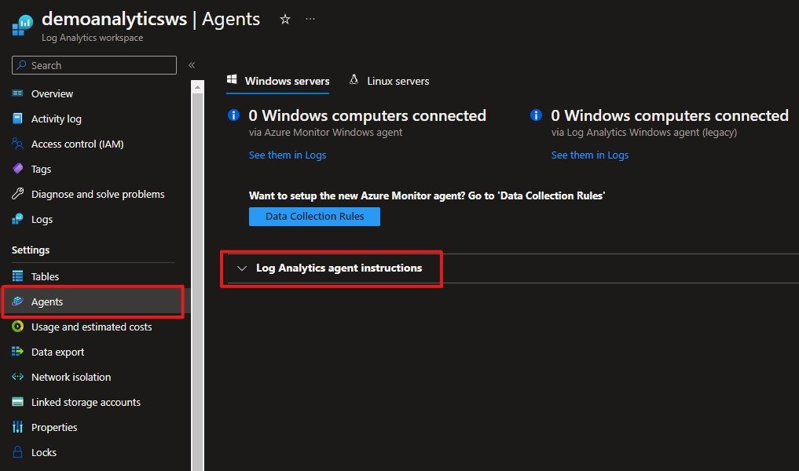

# Azure Log Analytics Handle

The class `AzureLogAnalyticsHandle` is a handler class for data interaction with Azure Log Analytics through MS-provided APIs. The class acts as a `TableHandle`. It defines an extract method `api_get()` and a load method `api_post()` - these methods have the aliases `read()` and `append()`, respectively. 

## Instantiation

When creating an instance of the `AzureLogAnalyticsHandle` the user must a workspace id and a shared key - both related to the source/sink Log Analytics Workspace resource in Azure. Note that these can be found retrieved using the [Azure CLI](https://learn.microsoft.com/en-us/cli/azure/monitor/log-analytics?view=azure-cli-latest) or in the Azure Portal by clicking 'Agents' section under the workspace resource - see image below:

The argument `log_table_name` allows the user to set a custom name for the source/sink log table in the given workspace. This relates the the 'Table' section under the workspace resource. 

## `api_get()`

The `api_get()` method has the alias `read()` to conform to the `TableHandle` concept.

The method has not been implemented yet. [Microsoft provides an API](https://learn.microsoft.com/en-us/rest/api/loganalytics/dataaccess/query/get?tabs=HTTP).

## `api_post()`

The `api_post()` method has the alias `append()` to conform to the `TableHandle` concept.

The `api_post()` method utilizes a Microsoft-provided API called [HTTP Data Collector API](https://learn.microsoft.com/en-us/rest/api/loganalytics/create-request).
