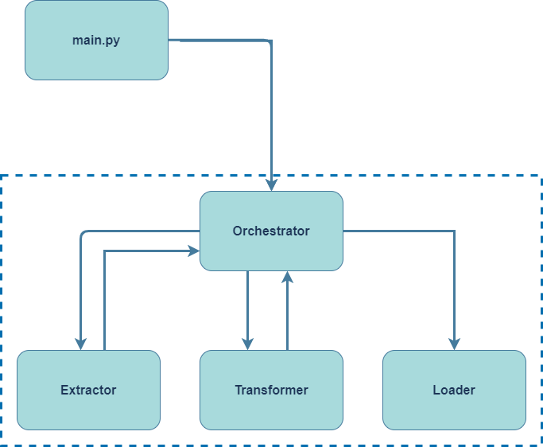

# ETL Orchestrator

## Introduction

This module contains components for implementing elegant ETL operations using the **[OETL Design Pattern](#OETL)**.

## OETL

Short for **Orchestrated Extract-Transform-Load** is a pattern that takes the ideas behind variations of the 
Model-View-Whatever design pattern



The **Orchestrator** is responsible for conducting the interactions between the 
**Extractor** -> **Transformer** -> **Loader**.

The **Ochestrator** reads data from the **Extractor** then uses the result as a parameter to calling the **Transformer**
and saves the transformed result into the **Loader**. The **Transformer** can be optional as there are scenarios where 
data transformation is not needed (i.e. raw data ingestion to a landing zone)

Each layer may have a single or multiple implementations, and this is handled automatically in the 
**Orchestrator**

## Orchestration Fluent Interface

This library provides common simple implementations and base classes for implementing the OETL design pattern. 
To simplify object construction, we provide the **Orchestrator** fluent interface from `spetlr.etl`

```python
from spetlr.etl import Extractor, Transformer, Loader, Orchestrator

(Orchestrator()
    .extract_from(Extractor())
    .transform_with(Transformer())
    .load_into(Loader())
    .execute())
```

### Principles

All ETL classes, **Orchestrator**, **Extractor**, **Transformer** and **Loader** are ETL objects.
This means that they have a method `etl(self, inputs: dataset_group) -> dataset_group`
(where `dataset_group = Dict[str, DataFrame]`) that transforms a set of import to a set of 
outputs. The special properties of each type are
 - **Extractor** always adds its result to the total set
 - **Transformer** handle a given number of inputs and adds a single result dataframe
 - **Loader** acts as a sink, while passing its input on to the next sink

The **Transformer** can run in two modes, controlled by the flag consume_inputs that is True by default. When True the transformer conumes its inputs and adds the output to the result dataframe. In usecases when there is a need to keep previously extracted (or transformed) dataframes after a transformation step set consume_inputs to False. When working with non conuming transformers it is crucial to set dataset input keys and dataset output keys. This ensures that the transformer and/or loader has explicit information on which dataframe(s) to handle.

The special case of the  **Orchestrator** is that it takes all its steps and executes them
in sequence on its inputs. Running in the default `execute()` method, the inputs are empty,
but an orchestrator can also be added as part of another orchestrator with the `step` method.

For the most general case of a many-to-many transformation, implement your step by inheriting
from the `EtlBase` class.


## Usage examples:

Here are some example usages and implementations of the ETL class provided

### Example-1

Here's an example of reading data from a single location, transforming it once and saving to a single destination.
This is the most simple etl case, and will be used as base for the below more complex examples.

```python
import pyspark.sql.functions as f
from pyspark.sql import DataFrame
from pyspark.sql.types import IntegerType

from spetlr.etl import Extractor, Transformer, Loader, Orchestrator
from spetlr.spark import Spark


class GuitarExtractor(Extractor):
    def read(self) -> DataFrame:
        return Spark.get().createDataFrame(
            Spark.get().sparkContext.parallelize(
                [
                    ("1", "Fender", "Telecaster", "1950"),
                    ("2", "Gibson", "Les Paul", "1959"),
                    ("3", "Ibanez", "RG", "1987"),
                ]
            ),
            """
            id STRING,
            brand STRING,
            model STRING,
            year STRING
            """,
        )


class BasicTransformer(Transformer):
    def process(self, df: DataFrame) -> DataFrame:
        print("Current DataFrame schema")
        df.printSchema()

        df = df.withColumn("id", f.col("id").cast(IntegerType()))
        df = df.withColumn("year", f.col("year").cast(IntegerType()))

        print("New DataFrame schema")
        df.printSchema()
        return df


class NoopLoader(Loader):
    def save(self, df: DataFrame) -> None:
        df.write.format("noop").mode("overwrite").save()
        df.printSchema()
        df.show()


print("ETL Orchestrator using a single simple transformer")
etl = (
    Orchestrator()
    .extract_from(GuitarExtractor())
    .transform_with(BasicTransformer())
    .load_into(NoopLoader())
)
etl.execute()

```

The code above produces the following output:

```
Original DataFrame schema
root
 |-- id: string (nullable = true)
 |-- brand: string (nullable = true)
 |-- model: string (nullable = true)
 |-- year: string (nullable = true)

New DataFrame schema
root
 |-- id: integer (nullable = true)
 |-- brand: string (nullable = true)
 |-- model: string (nullable = true)
 |-- year: integer (nullable = true)

+---+------+----------+----+
| id| brand|     model|year|
+---+------+----------+----+
|  1|Fender|Telecaster|1950|
|  2|Gibson|  Les Paul|1959|
|  3|Ibanez|        RG|1987|
+---+------+----------+----+
```

### Example-2

Here's an example of having multiple `Transformer` implementations that is reused to change the datatype of a given column,
where the column name is parameterized.

```python
import pyspark.sql.functions as f
from pyspark.sql import DataFrame
from pyspark.sql.types import StructType, StructField, IntegerType, StringType

from spetlr.etl import Extractor, Transformer, Loader, Orchestrator
from spetlr.spark import Spark


class GuitarExtractor(Extractor):
    def read(self) -> DataFrame:
        return Spark.get().createDataFrame(
            Spark.get().sparkContext.parallelize(
                [
                    ("1", "Fender", "Telecaster", "1950"),
                    ("2", "Gibson", "Les Paul", "1959"),
                    ("3", "Ibanez", "RG", "1987"),
                ]
            ),
            StructType(
                [
                    StructField("id", StringType()),
                    StructField("brand", StringType()),
                    StructField("model", StringType()),
                    StructField("year", StringType()),
                ]
            ),
        )


class IntegerColumnTransformer(Transformer):
    def __init__(self, col_name: str):
        super().__init__()
        self.col_name = col_name

    def process(self, df: DataFrame) -> DataFrame:
        df = df.withColumn(self.col_name, f.col(self.col_name).cast(IntegerType()))
        return df


class NoopLoader(Loader):
    def save(self, df: DataFrame) -> None:
        df.write.format("noop").mode("overwrite").save()
        df.printSchema()
        df.show()


print("ETL Orchestrator using multiple transformers")
etl = (
    Orchestrator()
    .extract_from(GuitarExtractor())
    .transform_with(IntegerColumnTransformer("id"))
    .transform_with(IntegerColumnTransformer("year"))
    .load_into(NoopLoader())
)
etl.execute()

```

### Example-3

Here's an example of having multiple `Extractor` implementations and applying transformations using 
the `process_many` method.

The `read()` function in `Extractor` will return a dictionary that uses the type name of the `Extractor` 
as the key, and a `DataFrame` as its value, the used kan can be overridden in the constructor.

`Transformer` provides the function `process_many(dataset: {})` and returns a single `DataFrame`.

```python
import pyspark.sql.functions as f
from pyspark.sql import DataFrame
from pyspark.sql.types import StructType, StructField, StringType

from spetlr.etl import Extractor, Loader, Orchestrator, Transformer
from spetlr.spark import Spark


class AmericanGuitarExtractor(Extractor):
    def read(self) -> DataFrame:
        return Spark.get().createDataFrame(
            Spark.get().sparkContext.parallelize(
                [
                    ("1", "Fender", "Telecaster", "1950"),
                    ("2", "Gibson", "Les Paul", "1959"),
                ]
            ),
            StructType(
                [
                    StructField("id", StringType()),
                    StructField("brand", StringType()),
                    StructField("model", StringType()),
                    StructField("year", StringType()),
                ]
            ),
        )


class JapaneseGuitarExtractor(Extractor):
    def __init__(self):
        super().__init__(dataset_key="japanese")

    def read(self) -> DataFrame:
        return Spark.get().createDataFrame(
            Spark.get().sparkContext.parallelize(
                [("3", "Ibanez", "RG", "1987"), ("4", "Takamine", "Pro Series", "1959")]
            ),
            StructType(
                [
                    StructField("id", StringType()),
                    StructField("brand", StringType()),
                    StructField("model", StringType()),
                    StructField("year", StringType()),
                ]
            ),
        )


class CountryOfOriginTransformer(Transformer):
    def process_many(self, dataset: {}) -> DataFrame:
        usa_df = dataset["AmericanGuitarExtractor"].withColumn("country", f.lit("USA"))
        jap_df = dataset["japanese"].withColumn("country", f.lit("Japan"))
        return usa_df.union(jap_df)


class NoopLoader(Loader):
    def save(self, df: DataFrame) -> None:
        df.write.format("noop").mode("overwrite").save()
        df.printSchema()
        df.show()


print("ETL Orchestrator using multiple extractors")
etl = (
    Orchestrator()
    .extract_from(AmericanGuitarExtractor())
    .extract_from(JapaneseGuitarExtractor())
    .transform_with(CountryOfOriginTransformer())
    .load_into(NoopLoader())
)
etl.execute()

```

The code above produces the following output:

```
root
 |-- id: string (nullable = true)
 |-- brand: string (nullable = true)
 |-- model: string (nullable = true)
 |-- year: string (nullable = true)
 |-- country: string (nullable = false)

+---+--------+----------+----+-------+
| id|   brand|     model|year|country|
+---+--------+----------+----+-------+
|  1|  Fender|Telecaster|1950|    USA|
|  2|  Gibson|  Les Paul|1959|    USA|
|  3|  Ibanez|        RG|1987|  Japan|
|  4|Takamine|Pro Series|1959|  Japan|
+---+--------+----------+----+-------+
```

### Example-4

Here's an example of data raw ingestion without applying any transformations.

```python
from pyspark.sql import DataFrame

from spetlr.etl import Extractor, Loader, Orchestrator
from spetlr.spark import Spark


class GuitarExtractor(Extractor):
    def read(self) -> DataFrame:
        return Spark.get().createDataFrame(
            Spark.get().sparkContext.parallelize(
                [
                    ("1", "Fender", "Telecaster", "1950"),
                    ("2", "Gibson", "Les Paul", "1959"),
                    ("3", "Ibanez", "RG", "1987"),
                ]
            ),
            """id STRING, brand STRING, model STRING, year STRING""",
        )


class NoopLoader(Loader):
    def save(self, df: DataFrame) -> None:
        df.write.format("noop").mode("overwrite").save()
        df.printSchema()
        df.show()


print("ETL Orchestrator with no transformations")
etl = Orchestrator().extract_from(GuitarExtractor()).load_into(NoopLoader())
etl.execute()

```

### Example-5

Here's an example of having multiple `Loader` implementations that is writing the transformed data into multiple destinations.

```python
import pyspark.sql.functions as f
from pyspark.sql import DataFrame
from pyspark.sql.types import StructType, StructField, IntegerType, StringType

from spetlr.etl import Extractor, Transformer, Loader, Orchestrator
from spetlr.spark import Spark


class GuitarExtractor(Extractor):
    def read(self) -> DataFrame:
        return Spark.get().createDataFrame(
            Spark.get().sparkContext.parallelize(
                [
                    ("1", "Fender", "Telecaster", "1950"),
                    ("2", "Gibson", "Les Paul", "1959"),
                    ("3", "Ibanez", "RG", "1987"),
                ]
            ),
            StructType(
                [
                    StructField("id", StringType()),
                    StructField("brand", StringType()),
                    StructField("model", StringType()),
                    StructField("year", StringType()),
                ]
            ),
        )


class BasicTransformer(Transformer):
    def process(self, df: DataFrame) -> DataFrame:
        print("Current DataFrame schema")
        df.printSchema()

        df = df.withColumn("id", f.col("id").cast(IntegerType()))
        df = df.withColumn("year", f.col("year").cast(IntegerType()))

        print("New DataFrame schema")
        df.printSchema()
        return df


class NoopSilverLoader(Loader):
    def save(self, df: DataFrame) -> None:
        df.write.format("noop").mode("overwrite").save()


class NoopGoldLoader(Loader):
    def save(self, df: DataFrame) -> None:
        df.write.format("noop").mode("overwrite").save()
        df.printSchema()
        df.show()


print("ETL Orchestrator using multiple loaders")
etl = (
    Orchestrator()
    .extract_from(GuitarExtractor())
    .transform_with(BasicTransformer())
    .load_into(NoopSilverLoader())
    .load_into(NoopGoldLoader())
)
etl.execute()

```

### Example-6

Using [Example-2](#Example-2), [Example-3](#Example-3) and [Example-5](#Example-5) as reference,
any combinations for single/multiple implementations of `Extractor`, `Transformer` or `Loader` can be created.

Here's an example of having both multiple `Extractor`, `Transformer` and `Loader` implementations.

It is important that the first transformer is a `MultiInputTransformer` when having multiple extractors.

```python
import pyspark.sql.functions as f
from pyspark.sql import DataFrame
from pyspark.sql.types import StructType, StructField, IntegerType, StringType

from spetlr.etl import Extractor, Transformer, Loader, Orchestrator
from spetlr.spark import Spark


class AmericanGuitarExtractor(Extractor):
    def read(self) -> DataFrame:
        return Spark.get().createDataFrame(
            Spark.get().sparkContext.parallelize(
                [
                    ("1", "Fender", "Telecaster", "1950"),
                    ("2", "Gibson", "Les Paul", "1959"),
                ]
            ),
            StructType(
                [
                    StructField("id", StringType()),
                    StructField("brand", StringType()),
                    StructField("model", StringType()),
                    StructField("year", StringType()),
                ]
            ),
        )


class JapaneseGuitarExtractor(Extractor):
    def read(self) -> DataFrame:
        return Spark.get().createDataFrame(
            Spark.get().sparkContext.parallelize(
                [("3", "Ibanez", "RG", "1987"), ("4", "Takamine", "Pro Series", "1959")]
            ),
            StructType(
                [
                    StructField("id", StringType()),
                    StructField("brand", StringType()),
                    StructField("model", StringType()),
                    StructField("year", StringType()),
                ]
            ),
        )


class CountryOfOriginTransformer(Transformer):
    def process_many(self, dataset: {}) -> DataFrame:
        usa_df = dataset["AmericanGuitarExtractor"].withColumn("country", f.lit("USA"))
        jap_df = dataset["JapaneseGuitarExtractor"].withColumn(
            "country", f.lit("Japan")
        )
        return usa_df.union(jap_df)


class BasicTransformer(Transformer):
    def process(self, df: DataFrame) -> DataFrame:
        print("Current DataFrame schema")
        df.printSchema()

        df = df.withColumn("id", f.col("id").cast(IntegerType()))
        df = df.withColumn("year", f.col("year").cast(IntegerType()))

        print("New DataFrame schema")
        df.printSchema()
        return df


class NoopSilverLoader(Loader):
    def save(self, df: DataFrame) -> None:
        df.write.format("noop").mode("overwrite").save()


class NoopGoldLoader(Loader):
    def save(self, df: DataFrame) -> None:
        df.write.format("noop").mode("overwrite").save()
        df.printSchema()
        df.show()


print("ETL Orchestrator using multiple loaders")
etl = (
    Orchestrator()
    .extract_from(AmericanGuitarExtractor())
    .extract_from(JapaneseGuitarExtractor())
    .transform_with(CountryOfOriginTransformer())
    .transform_with(BasicTransformer())
    .load_into(NoopSilverLoader())
    .load_into(NoopGoldLoader())
)
etl.execute()

```

### Example-7

This example illustrates the use of `Transformer` in a non conuming context.
The job here is to join the two extracted dataframes - an employees dataframe and a birthdays dataframe.
But, before the birthdays can be join onto the employees, the employees dataframe require a transformation step.
As the transformation step of employees is handled by an non conuming `Transformer`, it does not consume the other inputs from the `dataset_group`.
Hence, birthdays is still available from the inputs - even after the transformation of employees.
Then both frames can be joined and the final dataframe saved via an `Loader`.
When working with non conuming `Transformer` it is important to mind that dataset keys are crucial.
Setting both input and output dataset key(s) ensure that the `Transformers` and `Loaders` handle the intended dataframes.

```python
from typing import Union
import pyspark.sql.functions as f
from pyspark.sql import DataFrame
from pyspark.sql.types import IntegerType, StringType, StructField, StructType

from spetlr.etl import Extractor, Loader, Orchestrator, TransformerNC
from spetlr.etl.types import dataset_group
from spetlr.spark import Spark


class OfficeEmployeeExtractor(Extractor):
    def read(self) -> DataFrame:
        return Spark.get().createDataFrame(
            Spark.get().sparkContext.parallelize(
                [
                    ("1", "Michael Scott", "Regional Manager"),
                    ("2", "Dwight K. Schrute", "Assistant to the Regional Manager"),
                    ("3", "Jim Halpert", "Salesman"),
                    ("4", "Pam Beesly", "Receptionist"),
                ]
            ),
            StructType(
                [
                    StructField("id", StringType()),
                    StructField("name", StringType()),
                    StructField("position", StringType()),
                ]
            ),
        )


class OfficeBirthdaysExtractor(Extractor):
    def read(self) -> DataFrame:
        return Spark.get().createDataFrame(
            Spark.get().sparkContext.parallelize(
                [
                    (1, "March 15"),
                    (2, "January 20"),
                    (3, "October 1"),
                    (4, "March 25"),
                ]
            ),
            StructType(
                [
                    StructField("id", IntegerType()),
                    StructField("birthday", StringType()),
                ]
            ),
        )


class IntegerTransformer(Transformer):
    def process(self, df: DataFrame) -> DataFrame:
        return df.withColumn("id", f.col("id").cast(IntegerType()))


class JoinTransformer(Transformer):
    def process_many(self, dataset: dataset_group) -> DataFrame:

        df_employee = dataset["df_employee_transformed"]
        df_birthdays = dataset["df_birthdays"]

        return df_employee.join(other=df_birthdays, on="id")


class NoopLoader(Loader):
    def save(self, df: DataFrame) -> None:
        df.write.format("noop").mode("overwrite").save()
        df.printSchema()
        df.show()


print("ETL Orchestrator using two non consuming transformers")
etl = (
    Orchestrator()
    .extract_from(OfficeEmployeeExtractor(dataset_key="df_employee"))
    .extract_from(OfficeBirthdaysExtractor(dataset_key="df_birthdays"))
    .transform_with(
        IntegerTransformer(
            dataset_input_keys="df_employee",
            dataset_output_key="df_employee_transformed",
            consume_inputs=False,
        )
    )
    .transform_with(
        JoinTransformer(
            dataset_input_keys=["df_employee_transformed", "df_birthdays"],
            dataset_output_key="df_final",
        )
    )
    .load_into(NoopLoader(dataset_input_key="df_final"))
)
etl.execute()

```

### Example-8

This example illustrates the use of an orchestrator as just another ETL step.
The principle is called composit orchestration:

```python
import pyspark.sql.functions as F
import pyspark.sql.types as T
from pyspark.sql import DataFrame

from spetlr.etl import Extractor, Transformer, Loader, Orchestrator, dataset_group
from spetlr.spark import Spark


class AmericanGuitarExtractor(Extractor):
    def read(self) -> DataFrame:
        return Spark.get().createDataFrame(
            Spark.get().sparkContext.parallelize(
                [
                    ("1", "Fender", "Telecaster", "1950"),
                    ("2", "Gibson", "Les Paul", "1959"),
                ]
            ),
            T.StructType(
                [
                    T.StructField("id", T.StringType()),
                    T.StructField("brand", T.StringType()),
                    T.StructField("model", T.StringType()),
                    T.StructField("year", T.StringType()),
                ]
            ),
        )


class JapaneseGuitarExtractor(Extractor):
    def read(self) -> DataFrame:
        return Spark.get().createDataFrame(
            Spark.get().sparkContext.parallelize(
                [
                    ("3", "Ibanez", "RG", "1987"),
                    ("4", "Takamine", "Pro Series", "1959"),
                ]
            ),
            T.StructType(
                [
                    T.StructField("id", T.StringType()),
                    T.StructField("brand", T.StringType()),
                    T.StructField("model", T.StringType()),
                    T.StructField("year", T.StringType()),
                ]
            ),
        )


class CountryOfOriginTransformer(Transformer):
    def process_many(self, dataset: dataset_group) -> DataFrame:
        usa_df = dataset["AmericanGuitarExtractor"].withColumn("country", F.lit("USA"))
        jap_df = dataset["JapaneseGuitarExtractor"].withColumn("country", F.lit("Japan"))
        return usa_df.union(jap_df)


class OrchestratorLoader(Loader):
    def __init__(self, orchestrator: Orchestrator):
        super().__init__()
        self.orchestrator = orchestrator

    def save_many(self, datasets: dataset_group) -> None:
        self.orchestrator.execute(datasets)


class NoopLoader(Loader):
    def save(self, df: DataFrame) -> None:
        df.write.format("noop").mode("overwrite").save()
        df.printSchema()
        df.show()


print("ETL Orchestrator using composit inner orchestrator")
etl_inner = (
    Orchestrator()
    .transform_with(CountryOfOriginTransformer())
    .load_into(NoopLoader())
)

etl_outer = (
    Orchestrator()
    .extract_from(AmericanGuitarExtractor())
    .extract_from(JapaneseGuitarExtractor())
    .load_into(OrchestratorLoader(etl_inner))
)

etl_outer.execute()

```
