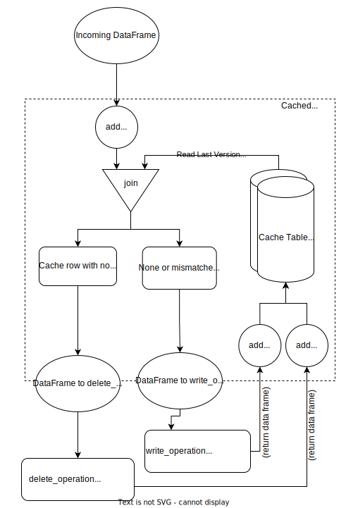

# ETL specializations

This area documents special classes that inherit from ETL base classes to 
solve specific generic tasks.

## Cache Loader

The Cache Loader is provided as `spetlr.cache.CacheLoader`. The cached loader 
passes only some rows on to the write operation, and not all. This can give 
optimizations for cases where the write operation is costly, such as writes 
to eventhub or cosmos. 

The following diagram illustrates the flow of data 
through the cached loader.


The foundation of the cached loader is a cache table that contains primary key 
columns and a hash for each row. 
The cached loader supports the following use-cases:
- write rows that are 
  - new wrt. the cache table
  - changed wrt. the cache table
- delete rows that are in the cache table but not in the data.

Use the class `spetlr.cache.CacheLoaderParameters` to configure all these features.
See the unittests for a full example for how to use the CachedLoader.

As a user of this base-class, inherit from it and override the methods 
`write_operation` and `delete_operation`. Only those rows that are returned
by your operation are merged back into the cache. You are therefore free
to apply further filters and limits at this stage.

### `write_operation`

The function receives a dataframe with those payload rows that the caching
logic has determined need to be written. In some cases, the user may want to
add further restrictions, such as limiting the size of written data.
Also, the user may want to add columns that identify the write operation in
other ways than simply by the writing timestamp (which the CachedLoader adds 
automatically). In this case, use the `cache_id_cols` parameters to call 
out these columns. These columns will be added to the cache table. This enables
you to find a given written batch and, for example, invalidate the cache so 
these rows are written again.

Remember that the caching logic makes a hash of all columns in the payload 
rows. Should you wish to add columns that are variable, such as adding a 
"publishedTimestamp", they should be added to the dataframe in the 
`write_operation` method, otherwise the row would always disagree with its
cached version and be written on every run.

Finally, whether you use the `cache_id_cols` or not, you need to return the 
rows that were actually written. The cache loader takes the returned rows and
updates the cache table with them, to mark them as having been written.

### `delete_operation`

The function receives a dataframe with those payload rows that the caching
logic has determined need to be removed, since they are missing in the input 
data. In some cases, the user may want to add further restrictions. In other
cases the user may not want to use the deleting functionality at all.
Therefore, this method needs to return the rows that were actually deleted,
(or return `None`). The cache loader takes the returned rows and
updates the cache table with them, to mark them as having been deleted.
returning `None` here skips the rest of the deleting logic.

## Simple Extrator/Loader

Often the step of extracting from, e.g. a delta handle or an eventhub,
can be so simple that is seems superfluous to use the etl framework. For
these cases a simple extractor and simple loader have been provided.
Any object with a `.read()` method can be passed to the `SimpleExtractor`.
Any object with a `.overwrite(df)` of a `.append(df)` method can be passed
to the `SimpleLoader`. See the following example:
```python
from spetlr.eh import EventHubCapture
from spetlr.delta import DeltaHandle
from spetlr.etl.loaders import SimpleLoader
from spetlr.etl.extractors import SimpleExtractor
from spetlr.etl import Orchestrator

class MyOrchestrator(Orchestrator):
  def __init__(self):
    super().__init__()
    self.extract_from(EventHubCapture.from_tc("MyEhDefinition"))
    self.load_into(DeltaHandle.from_tc("MyDeltaTable"))
```
