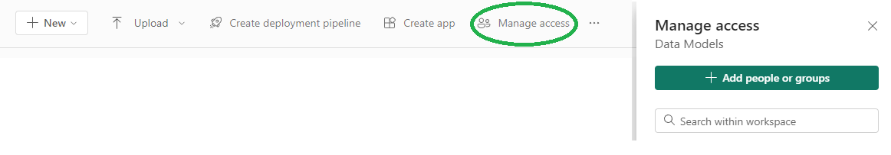
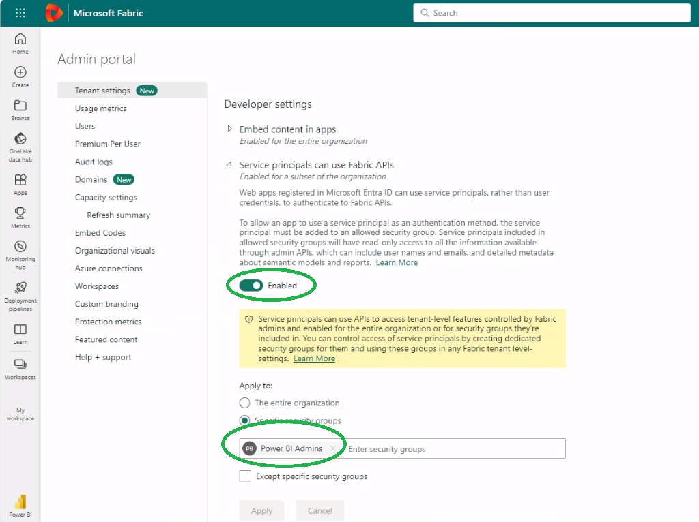
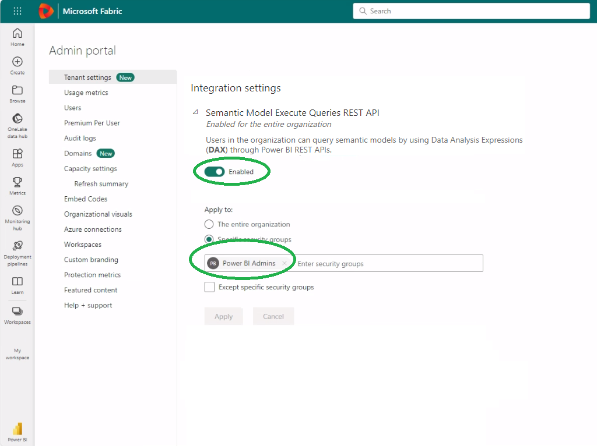
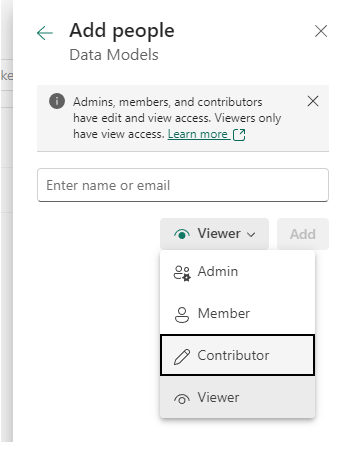
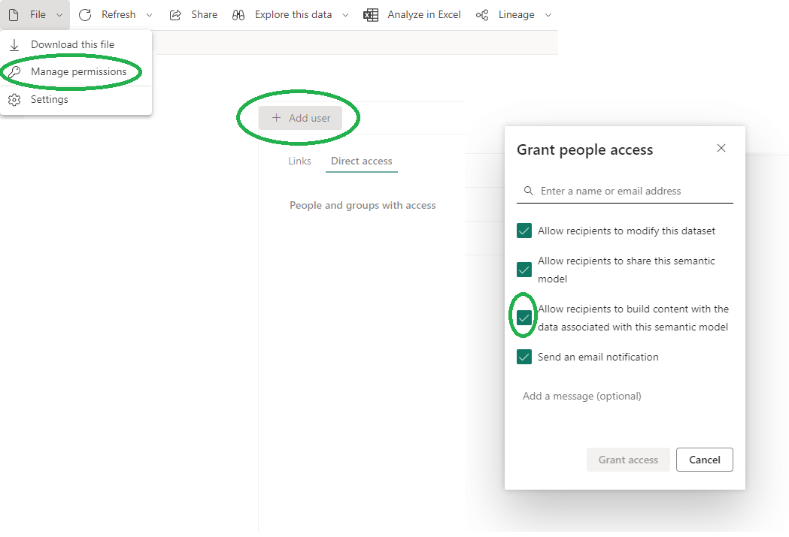

# PowerBi and PowerBiClient classes

The `PowerBi` and `PowerBiClient` classes contain logic for refreshing
PowerBI datasets or their selected tables, and for checking if the last
refresh of a dataset or its selected tables completed successfully.
The logic can also be used to show refresh histories of datasets,
and to list dataset tables with their recent refresh times.
The data can also be returned as a Spark data frame and used to
implement more advanced logic.

The classes use Pandas internally, so Spark is not required.

For easier PowerBI credential handling (service principal or AD user),
the first parameter to the `PowerBi` constructor must be a `PowerBiClient`
class object.

## PowerBI Permissions

The service principal or AD user or one of its user groups need to be
assigned to each PowerBI workspace you want to access to (see screen-shot).



To use the PowerBI API you need to enable the option
"Service principals can use Fabric APIs", found under
"Developer settings" in the Admin portal in Fabric (see screen-shot).
There, you can also specify the user group that can use the API.



The service principal or AD user mentioned earlier should be part
of this group, or the group itself needs to be assigned to the workspace
(unless you enable the API option for the entire organization).

Additionally, to access individual tables and their refresh times in
PowerBI, the class must be able to execute DAX queries. This requires
additional permission. The "Semantic Model Execute Queries REST API"
option, found under "Integration settings" in the Admin portal in Fabric
(see screen-shot), must also be enabled.



The same user group, service principal or user must have Read and Build
permissions to workspaces or individual datasets. You can do this either
on the workspace level or the dataset level. On the workspace level, when
clicking on "Manage access" as shown in the beginning, you can assign
a role to the user or user group. To assign Build permission to
on entire workspace to the given user or group, choose
the "Contributor", "Member", or "Admin" role (see screen-shot).
"Viewer" role doesn't have Build permission!



You can do the same on the dataset level as well (see screen-shot).



To start a refresh, the user must either have the "Contributor" role
on the workspace level, or the permission "Allow recipients to modify
this dataset" must be set on the dataset level (see screen-shot above).

## Links

[Register an App and give the needed permissions. A very good how-to-guide can be found here.](https://www.sqlshack.com/how-to-access-power-bi-rest-apis-programmatically/)

[How to Refresh a Power BI Dataset with Python.](https://pbi-guy.com/2022/01/07/refresh-a-power-bi-dataset-with-python/)

### API documentation:

[Get Workspaces](https://learn.microsoft.com/en-us/rest/api/power-bi/groups/get-groups)

[Get Datasets](https://learn.microsoft.com/en-us/rest/api/power-bi/datasets/get-datasets-in-group)

[Trigger A Dataset Refresh](https://learn.microsoft.com/en-us/rest/api/power-bi/datasets/refresh-dataset-in-group)

[Get Refresh History](https://learn.microsoft.com/en-us/rest/api/power-bi/datasets/get-refresh-history-in-group)

[Get Refresh History Details](https://learn.microsoft.com/en-us/rest/api/power-bi/datasets/get-refresh-execution-details-in-group)

[Execute DAX Queries](https://learn.microsoft.com/en-us/rest/api/power-bi/datasets/execute-queries-in-group)

# Usage of PowerBi and PowerBiClient classes

## Step 1: Create PowerBI credentials

The client ID, client secret, and tenant ID values should be stored
in a key vault, and loaded from the key vault or Databricks secret scope.

```python
# example PowerBiClient credentials object
from spetlr.power_bi.PowerBiClient import PowerBiClient 
from my_proj.env import secrets

class MyPowerBiClient(PowerBiClient):
    def __init__(self):
        super().__init__(
            client_id=secrets.get_power_bi_client(),
            client_secret=secrets.get_power_bi_secret(),
            tenant_id=secrets.get_power_bi_tenant(),
        )
```

## Step 2: List available workspaces

If no workspace parameter is specified, a list of available workspaces
is shown using Pandas. This logic can be used in a notebook.

```python
# example listing of available workspaces
from spetlr.power_bi.PowerBi import PowerBi 

client = MyPowerBiClient()
PowerBi(client).check()
```

```
Available workspaces:   
+----+--------------------------------------+----------------+
|    |            workspace_id              | workspace_name |
+----+--------------------------------------+----------------+
|   1| 614850c2-3a5c-4d2d-bcaa-d3f20f32a2e0 | Finance        |
|   2| 5da990e9-089e-472c-a7fa-4fc3dd096d01 | CRM            |
+----+--------------------------------------+----------------+
```

To get additional information about each workspace, use the 
show_workspaces() or the get_workspaces() method instead.
The first method shows a list of workspaces, and the second returns
a Spark data frame, with the list of workspaces.

```python
# example listing of available workspaces
from spetlr.power_bi.PowerBi import PowerBi 

client = MyPowerBiClient()
PowerBi(client).show_workspaces()
```

## Step 3: List available datasets

If no dataset parameter is specified, a list of available datasets
in the given workspace is shown using Pandas.
This logic can be used in a notebook.

The workspace can be specified either as a name or id, but not both.

```python
# example listing of available datasets
from spetlr.power_bi.PowerBi import PowerBi 

client = MyPowerBiClient()
PowerBi(client, workspace_name="Finance").check()

# alternatively:
PowerBi(client, workspace_id="614850c2-3a5c-4d2d-bcaa-d3f20f32a2e0").check()
```

```
Available datasets:
+----+--------------------------------------+----------------+
|    |             dataset_id               |  dataset_name  |
+----+--------------------------------------+----------------+
|   1| b1f0a07e-e348-402c-a2b2-11f3e31181ce | Invoicing      |
|   2| 2e848e9a-47a3-4b0e-a22a-af35507ec8c4 | Reimbursement  |
|   3| 4de28a6f-f7d4-4186-a529-bf6c65e67b31 | Fees           |
+----+--------------------------------------+----------------+
```

To get additional information about each dataset, use the 
show_datasets() or the get_datasets() method.
The first method shows a list of datasets, and the second returns
a Spark data frame, with the list of datasets.

If you don't specify any workspace, datasets from all workspaces
will be collected!

```python
# example listing of available workspaces
from spetlr.power_bi.PowerBi import PowerBi 

client = MyPowerBiClient()
PowerBi(client, workspace_name="Finance").show_datasets()

# alternatively:
PowerBi(client, workspace_id="614850c2-3a5c-4d2d-bcaa-d3f20f32a2e0").show_datasets()

# alternatively:
PowerBi(client).show_datasets()

```

## Step 4: Check the status and time of the last refresh of a given dataset

The check() method can be used to check the status and time of the last
refresh of an entire dataset, or of individual dataset tables. An exception
will be cast if the last refresh failed, or if the last refresh finished more
than the given number of minutes ago. The number of minutes can be specified
in the optional "max_minutes_after_last_refresh" parameter
(default is 12 hours).

If you want to check only selected tables in the dataset, you can
specify the optional "table_names" parameter with a list of table names.
If the list is not empty, only the selected tables will be checked,
and the table that was refreshed earliest will be used as a reference. 
To show the list of available tables, specify an empty array:
  table_names=[]

You can also specify the optional "local_timezone_name" parameter to show
the last refresh time of the PowerBI dataset in a local time zone.
It is only used for printing timestamps. The default time zone is UTC.

All parameters can only be specified in the constructor. 


```python
# example last refresh time checking
from spetlr.power_bi.PowerBi import PowerBi 

client = MyPowerBiClient()
PowerBi(client,
        workspace_name="Finance",
        dataset_name="Invoicing",
        max_minutes_after_last_refresh=2*60,
        local_timezone_name="Europe/Copenhagen").check()

# alternatively:
PowerBi(client,
        workspace_id="614850c2-3a5c-4d2d-bcaa-d3f20f32a2e0",
        dataset_id="b1f0a07e-e348-402c-a2b2-11f3e31181ce",
        max_minutes_after_last_refresh=2*60,
        local_timezone_name="Europe/Copenhagen").check()
```

```
Refresh completed successfully at 2024-02-01 10:15 (local time).
True   
```

```
Exception: Last refresh finished more than 15 minutes ago
at 2024-02-01 10:15 (local time) !
```

## Step 5: Start a new refresh of a given dataset without waiting

The start_refresh() method starts a new refresh of the given PowerBI
dataset asynchronously. To verify if the refresh succeeded, you need to
call the check() method after waiting some sufficiently long time
(e.g. from a separate monitoring job). 
With the optional "timeout_power_bi_in_seconds" you can specify a
time-out in seconds inside PowerBI. If the time-out is exceeded,
PowerBI will interrupt refreshing and return a time-out error.

If you want to refresh only selected tables in the dataset, you can
specify the optional "table_names" parameter with a list of table names.
If the list is not empty, only the selected tables will be refreshed.
To show the list of available tables, specify an empty array:
  table_names=[]

If you set the optional "mail_on_failure" or "mail_on_completion"
parameters to True, and e-mail will be sent to the dataset owner when
the refresh fails or completes respectively. This is only supported for
regular Azure AD users. Service principals cannot send emails!

Additionally, you can set the optional "number_of_retries" parameter to
specify the number of retries on transient errors when calling refresh().
The "number_of_retries" parameter only works with enhanced API requests
(i.e. when the "table_names" parameter is also specified), and it will
be ignored otherwise.
Default is 0 (no retries). E.g. 1 means two attempts in total.

Additionally, you can set the following optional parameters in
the constructor to control the refresh process in PowerBI:
- "max_parallelism" (int): Set the maximum number of threads that can
run processing commands in parallel during the refresh in PowerBI.
Default is None, which (according to Microsoft) corresponds to 10 threads.
- "apply_refresh_policy" (bool): Determine if the refresh policy is applied
or not (True or False). Default is None.
- "dataset_refresh_type" (str): The type of processing to perform when
refreshing the dataset ("Automatic", "Calculate", "ClearValues", "DataOnly",
"Defragment", "Full"). Default is None.
- "dataset_commit_mode" (str): Determines if dataset objects will be
committed in batches or only when complete ("PartialBatch", "Transactional").
Default is None.
- incremental_effective_date (str): Effective date for incremental load.
If an incremental refresh policy is applied, the effectiveDate parameter
overrides the current date. Default is None.

Description of values in the above parameters can be found here:
[Details](https://learn.microsoft.com/en-us/rest/api/power-bi/datasets/refresh-dataset-in-group)

All parameters can only be specified in the constructor. 


```python
# example starting of a dataset refresh
from spetlr.power_bi.PowerBi import PowerBi 

client = MyPowerBiClient()
PowerBi(client,
        workspace_name="Finance",
        dataset_name="Invoicing",
        table_names=["Jan2024, Feb2024"]).start_refresh()

# alternatively:
PowerBi(client,
        workspace_id="614850c2-3a5c-4d2d-bcaa-d3f20f32a2e0",
        dataset_id="b1f0a07e-e348-402c-a2b2-11f3e31181ce",
        table_names=["Jan2024, Feb2024"]).start_refresh()
```

```
A new refresh has been successfully triggered.
True
```

## Step 6: Start a new refresh of a given dataset and wait for the result

The refresh() method starts a new refresh of the given PowerBI dataset
synchronously. It waits until the refresh is finished or until a time-out
occurs. The time-out can be specified using the "timeout_in_seconds"
parameter (default is 15 minutes). 
If the refresh fails or a time-out occurs, the method casts an exception.
With the optional "timeout_power_bi_in_seconds" you can specify a similar
time-out in seconds but inside PowerBI. If the time-out is exceeded,
PowerBI will interrupt refreshing and return a time-out error.

The wait time between calls to the PowerBI API is synchronized with the
average execution time of previous dataset refreshes via API (only calls
refreshing all tables), making sure as few requests to the PowerBI API would
be made as possible, while ensuring the method finishes as soon as possible.

If you want to refresh only selected tables in the dataset, you can
specify the optional "table_names" parameter with a list of table names.
If the list is not empty, only selected tables will be refreshed
(and the previous refresh time will be ignored).
To show the list of available tables, specify an empty array:
  table_names=[]

Additionally, you can set the optional "number_of_retries" parameter to
specify the number of retries on transient errors when calling refresh().
Default is 0 (no retries). E.g. 1 means two attempts in total.
It is used only when the "timeout_in_seconds" parameter allows it,
so you need to set the "timeout_in_seconds" parameter high enough.
The "number_of_retries" parameter is handled in a loop in this class,
and unlike in the start_refresh() method, it will work both with normal
refreshes (i.e. when "table_names" is not specified) and with enhanced
refreshes (i.e. when "table_names" is specified).

Additionally, you can set the following optional parameters in
the constructor to control the refresh process in PowerBI:
- "max_parallelism" (int): Set the maximum number of threads that can
run processing commands in parallel during the refresh in PowerBI.
Default is None, which (according to Microsoft) corresponds to 10 threads.
- "apply_refresh_policy" (bool): Determine if the refresh policy is applied
or not (True or False). Default is None.
- "dataset_refresh_type" (str): The type of processing to perform when
refreshing the dataset ("Automatic", "Calculate", "ClearValues", "DataOnly",
"Defragment", "Full"). Default is None.
- "dataset_commit_mode" (str): Determines if dataset objects will be
committed in batches or only when complete ("PartialBatch", "Transactional").
Default is None.
- incremental_effective_date (str): Effective date for incremental load.
If an incremental refresh policy is applied, the effectiveDate parameter
overrides the current date. Default is None.

Description of values in the above parameters can be found here:
[Details](https://learn.microsoft.com/en-us/rest/api/power-bi/datasets/refresh-dataset-in-group)

You can also specify the optional "local_timezone_name" parameter to
show the last refresh time of the PowerBI dataset in a local time zone.
It is only used for printing timestamps. The default time zone is UTC. 

All parameters can only be specified in the constructor. 


```python
# example starting of a dataset refresh
from spetlr.power_bi.PowerBi import PowerBi 

client = MyPowerBiClient()
PowerBi(client,
        workspace_name="Finance",
        dataset_name="Invoicing",
        timeout_in_seconds=10*60,
        timeout_power_bi_in_seconds=10*60,
        number_of_retries=2,
        local_timezone_name="Europe/Copenhagen").refresh()

# alternatively:
PowerBi(client,
        workspace_id="614850c2-3a5c-4d2d-bcaa-d3f20f32a2e0",
        dataset_id="b1f0a07e-e348-402c-a2b2-11f3e31181ce",
        timeout_in_seconds=10*60,
        timeout_power_bi_in_seconds=10*60,
        number_of_retries=2,
        local_timezone_name="Europe/Copenhagen").refresh()
```

```
A new refresh has been successfully triggered.
Waiting 60 seconds...
Waiting 15 seconds...
Refresh completed successfully at 2024-02-02 09:02 (local time).
True
```

## Step 7: Show and get the refresh history of a given dataset

The show_history() and get_history() methods can be used to show and get
the refresh history of a given dataset. The show_history() method displays
a Pandas data frame with the refresh history, and the get_history() method
returns the actual data frame converted to a Spark data frame. 

According to MSDN, "there are always between 20–60 available refresh history
entries for each dataset, depending on the number of refreshes in the last 3 days.
The most recent 60 are kept if they are all less than 3 days old. Entries
more than 3 days old are deleted when there are more than 20 entries."

If you don't specify any dataset and/or workspace, the history across all 
datasets/workspaces will be collected. The datasets must be refreshable
and workspaces cannot be read-only to be included in the combined list.
To exclude specific PowerBI creators from the list, specify the optional
"exclude_creators" parameter, e.g.:
   exclude_creators=["amelia@contoso.com"]

You can also specify the optional "local_timezone_name" parameter to convert
refresh times in the data frame to a local timezone. Depending on the parameter,
the names of the time columns in the data frame will have the suffix
"Utc" or "Local".

All above parameters can only be specified in the constructor. 

```python
# example show and get refresh history
from spetlr.power_bi.PowerBi import PowerBi 

client = MyPowerBiClient()
PowerBi(client,
        workspace_name="Finance",
        dataset_name="Invoicing",
        local_timezone_name="Europe/Copenhagen").show_history()

PowerBi(client,
        workspace_name="Finance",
        dataset_name="Invoicing",
        local_timezone_name="Europe/Copenhagen").show_history()

# alternatively:
df = PowerBi(client,
        workspace_id="614850c2-3a5c-4d2d-bcaa-d3f20f32a2e0",
        dataset_id="b1f0a07e-e348-402c-a2b2-11f3e31181ce",
        local_timezone_name="Europe/Copenhagen").get_history()

df = PowerBi(client,
        workspace_id="614850c2-3a5c-4d2d-bcaa-d3f20f32a2e0",
        dataset_id="b1f0a07e-e348-402c-a2b2-11f3e31181ce",
        local_timezone_name="Europe/Copenhagen").get_history()

df.display()
```

The "RefreshType" column has the following meaning:

RefreshType | |
--- | ---
OnDemand | The refresh was triggered interactively through the Power BI portal.
OnDemandTraining | The refresh was triggered interactively through the Power BI portal with automatic aggregations training.
Scheduled | The refresh was triggered by a dataset refresh schedule setting.
ViaApi | The refresh was triggered by an API call, e.g. by using this class without the "table_names" parameter specified.
ViaEnhancedApi | The refresh was triggered by an enhanced API call, e.g. by using this class with the "table_names" or "max_parallelism" parameter specified.
ViaXmlaEndpoint | The refresh was triggered through Power BI public XMLA endpoint.

Only "ViaApi" and "ViaEnhancedApi" refreshes can be triggered by this class.
"ViaApi" are refreshes without the "table_names" parameter specified,
and "ViaEnhancedApi" are refreshes with the "table_names" or "max_parallelism" parameter specified.

To see what tables were specified with each completed refresh marked as
"ViaEnhancedApi", you can use the show_history_details() and get_history_details()
methods, as shown below. They work in the same fashion and have the same parameters
as the show_history() and get_history() methods.
You can then use the "RequestId" column in the "get_history"
and "get_history_details" datasets to join them together.

```python
# example show and get refresh history
from spetlr.power_bi.PowerBi import PowerBi 

client = MyPowerBiClient()
PowerBi(client,
        workspace_name="Finance",
        dataset_name="Invoicing",
        local_timezone_name="Europe/Copenhagen").show_history_details()

PowerBi(client,
        workspace_name="Finance",
        dataset_name="Invoicing",
        local_timezone_name="Europe/Copenhagen").show_history_details()

# alternatively:
df = PowerBi(client,
        workspace_id="614850c2-3a5c-4d2d-bcaa-d3f20f32a2e0",
        dataset_id="b1f0a07e-e348-402c-a2b2-11f3e31181ce",
        local_timezone_name="Europe/Copenhagen").get_history_details()

df = PowerBi(client,
        workspace_id="614850c2-3a5c-4d2d-bcaa-d3f20f32a2e0",
        dataset_id="b1f0a07e-e348-402c-a2b2-11f3e31181ce",
        local_timezone_name="Europe/Copenhagen").get_history_details()

df.display()
```

## Step 8: Show and get the tables in a given dataset

The show_tables() and get_tables() methods can be used to show and get
the list of tables used in a given dataset and their last refresh time.
The show_tables() method displays a Pandas data frame with the list of tables,
and the get_tables() method returns the actual data frame converted to
a Spark data frame. 

If you don't specify any dataset and/or workspace, all tables across all 
datasets/workspaces will be collected. Datasets requiring an effective
identity will be automatically skipped from the list (effective
identity is not supported by this class).
To exclude specific PowerBI creators from the list, specify the optional
"exclude_creators" parameter, e.g.
   exclude_creators=["amelia@contoso.com"]
 This can prevent "Skipped unauthorized" warnings.

You can also specify the optional "local_timezone_name" parameter to convert
table refresh times to a local timezone. Depending on the parameter,
the names of the time columns in the data frame will have the suffix
"Utc" or "Local".

All above parameters can only be specified in the constructor. 

```python
# example show and get the table list
from spetlr.power_bi.PowerBi import PowerBi 

client = MyPowerBiClient()
PowerBi(client,
        workspace_name="Finance",
        dataset_name="Invoicing",
        local_timezone_name="Europe/Copenhagen").show_tables()

PowerBi(client,
        workspace_name="Finance",
        dataset_name="Invoicing",
        local_timezone_name="Europe/Copenhagen").show_tables()

# alternatively:
df = PowerBi(client,
        workspace_id="614850c2-3a5c-4d2d-bcaa-d3f20f32a2e0",
        dataset_id="b1f0a07e-e348-402c-a2b2-11f3e31181ce",
        local_timezone_name="Europe/Copenhagen").get_tables()

df = PowerBi(client,
        workspace_id="614850c2-3a5c-4d2d-bcaa-d3f20f32a2e0",
        dataset_id="b1f0a07e-e348-402c-a2b2-11f3e31181ce",
        local_timezone_name="Europe/Copenhagen").get_tables()

df.display()

```

# Testing

Due to license restrictions, integration testing requires a valid
PowerBI license. Because of this, integration testing of this class
must be executed manually in each project that uses spetlr.

Recommended integration tests should include all above examples, i.e. 
listing of workspaces and datasets, checking a refresh, and possibly
triggering a new refresh.
