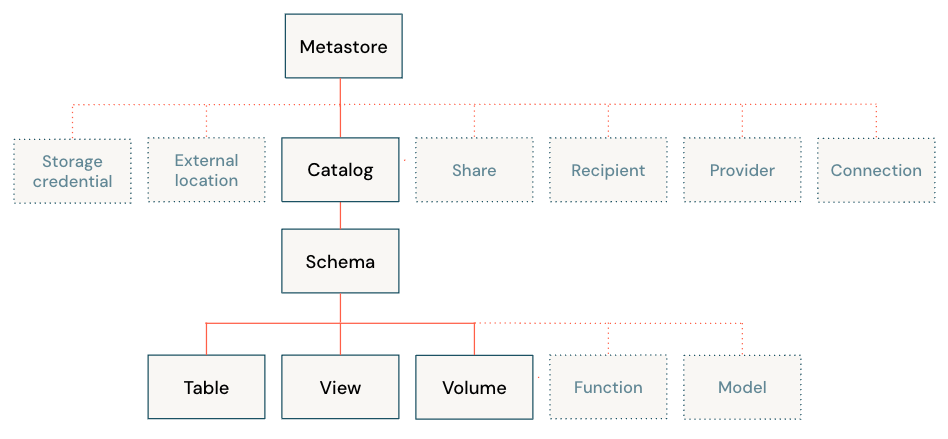

# Unity Catalog (Metastore)

Unity Catalog provides centralized access control, auditing, lineage, and data discovery capabilities across Azure Databricks workspaces. This section covers the Unity Catalog object model and then provides a guide how to use it with SPETLR.

## The Unity Catalog object model

In Unity Catalog, the hierarchy of primary data objects flows from metastore to table or volume:

- __Metastore__: The top-level container for metadata. Each metastore exposes a three-level namespace (catalog.schema.table) that organizes your data.
- __Catalog__: The first layer of the object hierarchy, used to organize your data assets.
- __Schema__: Also known as databases, schemas are the second layer of the object hierarchy and contain tables and views.
- __Volume__: Volumes sit alongside tables and views at the lowest level of the object hierarchy and provide governance for non-tabular data.
- __Table__: At the lowest level in the object hierarchy are tables and views.

[Read more of the official documentation from Microsoft here](https://learn.microsoft.com/en-us/azure/databricks/data-governance/unity-catalog/)

## Infrastructure as code (Azure)

This section covers what resources are needed to deploy and setup a metastore for unity catalog. Furthermore, it is required that the user (or service principal) used to configure the metastore has is a global admin in Azure. 

#### Resources
- Azure Data Lake Storage Gen2 + a container for the metastore. This will be the default location for managed tables and metadata associated with the metastore. This must be in the same region as the workspace(s) you want to use to access the data. Note that you can only create one metastore per region.
- Azure Databricks Access Connector. This acts as an identity for Databricks to access the data lake. Ensure to enable system assigned identity to this resource.
- Databricks workspace. Used to configure and setup the metastore. Currently, using the Databricks CLI, it is only possible to setup a metastore from within a workspace. Therefore, it is recommended to have a workspace only used for configuration of the metastore / unity catalog.

It is recommended that these resources are placed in their own resource group.

#### Deployment process and setup metastore
Refer to [this file](../../.github/deploy/steps/85-Create-And-Connect-Metastore.ps1) to see an example of how a metastore is configured.
1. Deploy the resources described above
2. Assign the role "Storage Blob Data Contributor" to the Access Connector (Azure CLI: `az role assignment create`)
3. Connect to the databricks workspace using the Databricks CLI: `databricks configure`
4. Create a metastore (Databricks CLI: `databricks unity-catalog metastores create`)
5. Assign the Databricks workspace to the metastore just created (Databricks CLI: `databricks unity-catalog metastores assign`)
6. In the Databricks workspace add the Access Connector Id as a storage credential (Databricks CLI: `databricks unity-catalog storage-credentials create`)
7. Fetch the id of the storage credential (an UUID) and add this to the metastore using the update command (Databricks CLI: `databricks unity-catalog metastores update`)
8. Create a catalog to ensure that the credential to the container is valid (Databricks CLI: `databricks unity-catalog catalogs create`)
9. Done!